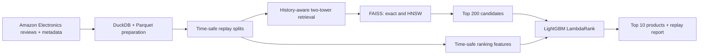

# Rekindle

**Rekindle** is a time-aware, two-stage product-discovery system for Amazon Electronics.
It models review presence as implicit feedback, retrieves candidates with a history-aware
two-tower model, and reranks them with LightGBM.

The project is unaffiliated with Amazon. It uses the Amazon Reviews 2023 dataset and does
not redistribute source data or product-level outputs.

## What it is designed to demonstrate

- Time-safe, sequential offline replay instead of a random train/test split.
- Two-stage recommendation: vector retrieval followed by learning-to-rank.
- A measured recall–latency comparison between exact FAISS and HNSW.
- Explicit treatment of warm, cold, head, and long-tail evaluation slices.
- Reproducible local experimentation on an Apple Silicon Mac.

## Architecture



## Status

The project foundation is in place. The data-preparation and baseline stages are the first
implementation milestone. Metrics and résumé claims will be added only after reproducible
experiments complete.

## Quick start

```bash
uv sync --all-extras
uv run rekindle --help
uv run pytest
```

Raw data belongs in `data/raw/` and is intentionally ignored by Git. See
[`data/README.md`](data/README.md) for the expected local layout.

## Planned commands

```bash
uv run rekindle prepare-data --config config/base.yaml
uv run rekindle train-retriever --config config/base.yaml
uv run rekindle generate-ranker-data --config config/base.yaml
uv run rekindle train-ranker --config config/base.yaml
uv run rekindle evaluate --config config/base.yaml
uv run rekindle benchmark --config config/base.yaml
uv run rekindle recommend --user-id <id>
```

## Reproducibility boundaries

Committed: source, configuration, tests, synthetic fixtures, design docs, and aggregate
reports. Local only: raw data, Parquet tables, MLflow runs, indexes, models, and caches.

## Evaluation contract

Model weights are frozen before replay. A target event can use only the user history and
aggregate features available before its timestamp. The main benchmark uses a warm catalog;
metadata-only cold-item behavior is reported as a separately labelled synthetic simulation.

Headline metrics are retrieval Recall@100, final NDCG@10, and P50/P95 stage latency. The
final report will compare time-decayed popularity, item–item CF, retrieval-only, and the
two-stage system.
