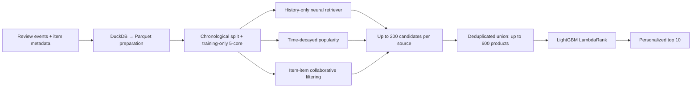

# Rekindle: Building a Time-Safe Two-Stage Recommender System

## Project summary

Rekindle is a portfolio recommender system for Amazon Reviews 2023 Electronics. I built it to understand how an end-to-end, two-stage recommendation system works in practice: how to narrow a large product catalog into candidates, personalize the final ranking, and evaluate the result without accidentally using future information.

The project treats the presence of a product review as an implicit interaction signal. It does not predict star ratings, and it deliberately excludes ratings from model features and targets.

This is an independent portfolio project and is not affiliated with Amazon.

## Why I built it

I wanted to learn more than how to fit a single regression or neural-network model. Recommendation systems have interconnected stages: data preparation, candidate retrieval, ranking, evaluation, and serving all affect the result. A model can look good in isolation while the complete system still fails to surface useful products.

Amazon Electronics was a useful setting because it is large, behavior-driven, and messy. It required me to make practical tradeoffs on an 18 GB M3 Pro Mac instead of assuming the whole dataset could fit in memory or that a larger model would solve every problem.

## Important limitation of the data

A review is an imperfect engagement proxy, not confirmed purchase or exposure data. A reviewer may have received an item as a gift, left an incentivized review, or written an unverified review. Production systems should use richer signals—such as impressions, views, carts, purchases, product availability, and price—when they are available.

The goal here is therefore narrow and explicit: predict which warm-catalog product a user is likely to review next under a strict offline replay protocol.

## Data pipeline and safeguards

I processed raw Amazon Electronics review and metadata JSONL with DuckDB rather than materializing the source data in pandas. DuckDB was configured with an 8 GB memory limit and disk-backed temporary storage; the resulting canonical interaction and metadata tables were stored as ZSTD-compressed Parquet for compact downstream processing.

The interaction pipeline:

1. Retained a recent 36-month review window.
2. Normalized reviews to `user_id`, product `parent_asin`, event timestamp, and a retained `verified_purchase` field.
3. Deduplicated repeated user-product reviews by retaining the latest interaction.
4. Created one global chronological 80/10/10 train/validation/test split.
5. Computed an iterative 5-core warm set from **training interactions only**.
6. Attached warm-user and warm-item membership to every split without using validation or test interactions to decide membership.

This produced 13.4M canonical events. The training-only warm collaborative catalog contained 141,000 users and 55,927 items. The final test replay evaluated 29,416 eligible warm events.

### Why time safety mattered

I have seen projects where results look great until a feature is found to contain future data. At that point, the model may be learning leakage rather than user behavior. Rekindle treats time safety as a design constraint:

- Models train only on earlier events.
- A replay event can use only the user's preceding interactions.
- All previously seen products are removed from that user's candidate list.
- The 5-core is derived from train data only.
- The ranker is trained with rolling temporal cross-fitting, so its candidate-generation features are generated by retrievers that were trained only on earlier periods.
- Missed retrieval targets are never injected into ranker training or evaluation.

## System design

### Candidate retrieval

The first stage is intentionally fast. Three different sources each produce up to 200 unseen products:

- A two-tower neural retriever using a recency-weighted history of the last 20 products.
- A time-decayed popularity baseline.
- Sparse item-item cosine collaborative filtering based on recent history.

Their deduplicated candidate union contains up to 600 products. This matters because the ranker cannot recover a product that retrieval never proposed.

### Ranking

LightGBM LambdaRank reranks the union to a final top 10. Its features include each channel's inverse rank, source count, time-decayed popularity, user-history length, and category/brand affinity to recent history. Ranker data is generated with three rolling temporal folds rather than with in-sample retrieval scores.

## A result that changed my approach

I initially expected the neural retriever to be the strongest standalone model. The first sampled validation metric appeared reasonably high, but full-catalog evaluation against the complete warm catalog was much lower: exact neural Recall@100 was about 0.036–0.038.

That was a useful reality check. I changed retriever model selection to use exact full-catalog recall and kept sampled recall only as a diagnostic. I also tested a history-only ablation to avoid relying on weak sparse user-ID embeddings. It was slightly stronger and faster, but not a dramatic standalone win.

Rather than hiding that result, I kept neural retrieval as a diverse source. On validation, the combined union recovered the target for 16.0% of events, exceeding every single source. This made the project a better example of the retrieval-versus-ranking tradeoff than a story about one model winning everywhere.

## Evaluation results

The final replay froze all models and scored every eligible test event in chronological order. A retrieval miss received zero credit, so the end-to-end metric includes both retrieval coverage and ranking quality.

| System | HitRate@10 | NDCG@10 |
| --- | ---: | ---: |
| Neural retriever only | 0.0093 | 0.0045 |
| Time-decayed popularity | 0.0151 | 0.0071 |
| Item-item CF | 0.0125 | 0.0071 |
| **Rekindle: three-source retrieval + LambdaRank** | **0.0203** | **0.0104** |

Rekindle improved end-to-end NDCG@10 by **46.5%** over the strongest time-safe baseline, an absolute improvement of 0.0033. The final candidate union had Recall@200 of 0.1484, showing that candidate generation remains the largest constraint on future gains.

### Confidence intervals

I used 2,000 deterministic paired bootstrap resamples of the same 29,416 replay events. Pairing is important because it measures the system and each baseline on identical events.

| Measurement | 95% confidence interval |
| --- | ---: |
| Final NDCG@10 | [0.0095, 0.0113] |
| NDCG lift over popularity | [+0.0023, +0.0043] |
| NDCG lift over item-item CF | [+0.0023, +0.0042] |

Both paired lift intervals remain above zero. This supports the conclusion that the observed offline improvement is unlikely to be the result of a lucky selection of test events. It does not replace an online A/B test or establish business impact.

## Local latency benchmark

I also measured the frozen model components on the M3 Pro with 1,000 warm replay queries in a single-worker, warm-process benchmark. Index construction and model loading were excluded.

| Component | P50 | P95 |
| --- | ---: | ---: |
| MPS query encoding + transfer to CPU FAISS | 0.730 ms | 1.594 ms |
| Exact FAISS retrieval | 0.512 ms | 0.585 ms |
| HNSW retrieval | 0.220 ms | 0.286 ms |
| LambdaRank scoring | 1.968 ms | 2.072 ms |

HNSW was about 2.3× faster than exact FAISS retrieval, but preserved 88.7% of exact top-200 candidates. Exact FAISS was already fast enough for the 55.9k-item warm catalog, so I retained it as the default quality path and treated HNSW as a scaling option rather than an automatic upgrade.

These are **component** measurements, not a full serving-latency claim. They exclude popularity and item-CF candidate construction, ranking-feature assembly, API handling, storage reads, and network overhead.

## Engineering decisions

- **Use the right runtime for each workload.** DuckDB handled disk-backed aggregation; PyTorch used MPS for neural development; FAISS and LightGBM ran through their CPU-native paths.
- **Prefer an honest metric to a flattering metric.** Full-catalog recall became the retriever's selection metric after sampled evaluation proved overoptimistic.
- **Choose the system, not the favorite model.** The neural retriever was not the best standalone source, but its distinct candidates helped the union improve final ranking.
- **Keep exact retrieval when it is already cheap.** HNSW reduced search time, but the candidate-overlap tradeoff was not compelling at this catalog size.
- **Make every result reproducible.** The project uses CLI pipeline stages, saved artifacts, configuration, fixed evaluation subsets, and a data manifest with raw-input hashes.

## What I would improve with production data

The first improvement would be candidate generation. Because union Recall@200 is 0.1484, even a perfect ranker cannot recover targets that never enter the shortlist. With richer production data, I would:

1. Use impressions, views, carts, purchases, availability, and price rather than reviews alone.
2. Add content and co-purchase signals to retrieval, especially for cold products.
3. Run error slices by user-history depth and product popularity before selecting new models.
4. Validate offline changes with online CTR or conversion experiments.
5. Revisit approximate retrieval at a larger catalog size, tuning HNSW's recall-latency tradeoff.

## What I learned

Rekindle taught me that recommendation systems are not simply larger neural-network projects. Data quality, retrieval coverage, ranking, evaluation, and operational constraints are coupled. A model can produce an attractive metric for the wrong reason; a weaker model can still be valuable as one part of a broader system; and the best tradeoff depends on the actual data, catalog size, and latency budget.

The project demonstrates the kind of work I want to do as an ML or data engineer: build an end-to-end system, measure it honestly, and make practical engineering decisions under real resource constraints.
